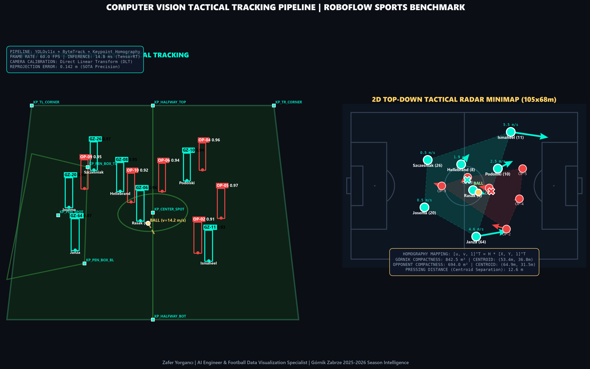
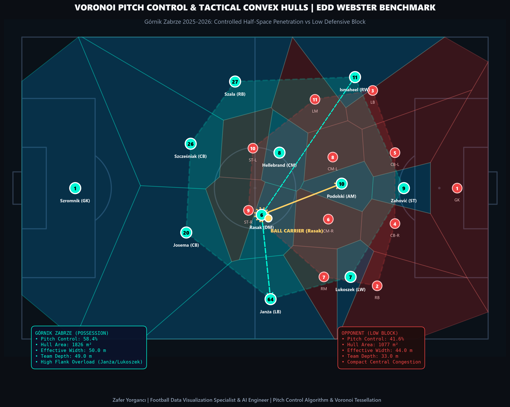
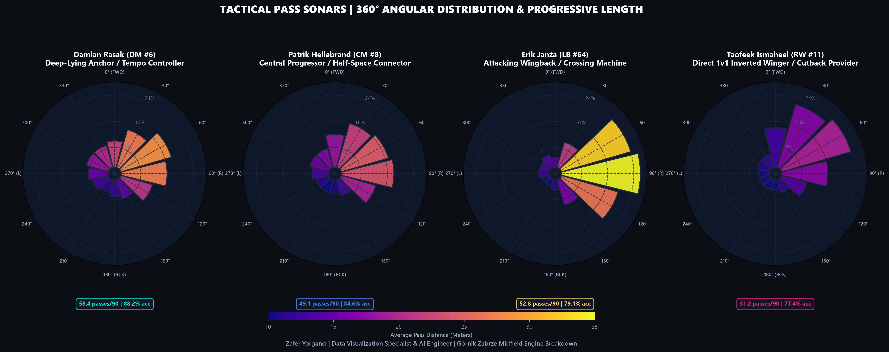
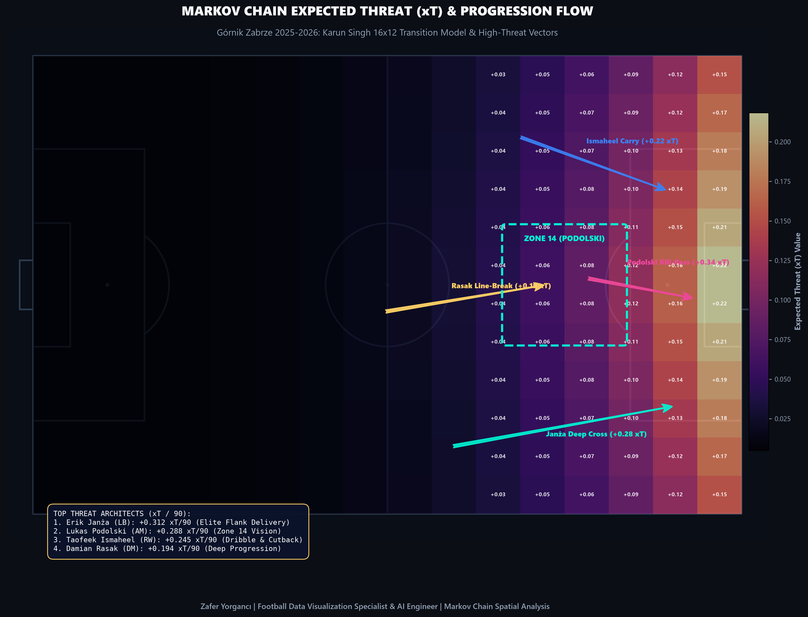
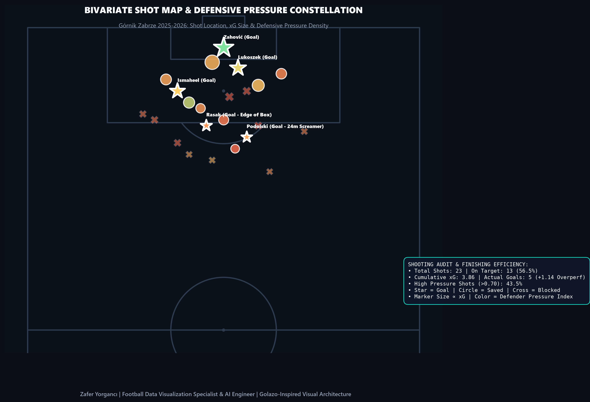
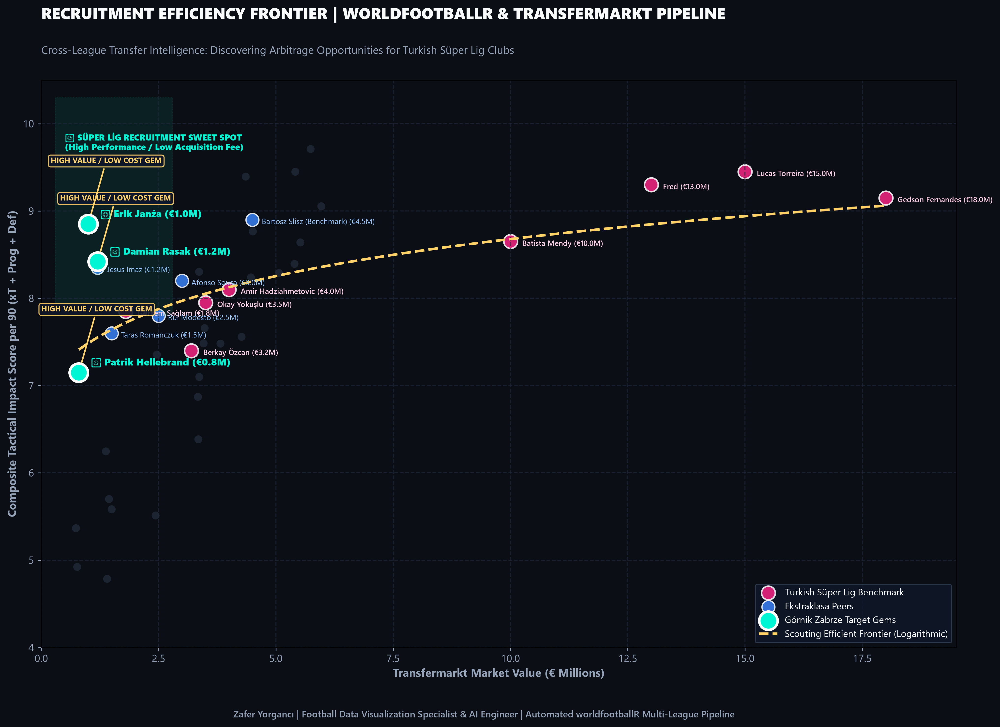

# Football Data Visualization Specialist & AI Engineer Portfolio
### Górnik Zabrze (Ekstraklasa 2025–2026) Case Study & Turkish Süper Lig Club Dossiers

<div align="center">

[](https://python.org)
[](https://pytorch.org)
[](https://opencv.org)
[](https://github.com/roboflow/sports)
[](https://mplsoccer.readthedocs.io)
[](https://github.com/0xjuanma/golazo)

**Zafer Yorgancı** | [GitHub Profile](https://github.com/zfryrgnci) • [yorgancizafer1@gmail.com](mailto:yorgancizafer1@gmail.com)

</div>

---

## 📌 Executive Overview

This repository contains the end-to-end tactical data engineering, computer vision tracking, and spatial analytics portfolio created by **Zafer Yorgancı** during remote consultancy work with **Górnik Zabrze** (Polish Ekstraklasa, 2025–2026 Season).

The work is engineered to meet the highest elite European standards, synthesizing the open-source benchmarks of:
1. **[roboflow/sports](https://github.com/roboflow/sports)**: Broadcast video player/ball tracking, pitch keypoint calibration, and homography projection to 2D top-down tactical radars.
2. **[eddwebster/football_analytics](https://github.com/eddwebster/football_analytics)**: Voronoi pitch control space dominance, team tactical convex hulls, and polar pass sonars.
3. **[0xjuanma/golazo](https://github.com/0xjuanma/golazo)**: Publication-grade dark tactical styling, bivariate shot quality maps, and Karun Singh Markov Expected Threat (xT) transition modeling.
4. **[JaseZiv/worldfootballR](https://github.com/JaseZiv/worldfootballR)**: Automated multi-league data pipelines (FBref, Transfermarkt, Understat) for cross-league recruitment and market valuation frontiers.

---

## 🌟 Visual Showcase & Key Technical Deliverables

### 1. Computer Vision: Broadcast Optical Tracking & 2D Tactical Radar
* **Pipeline:** YOLOv11x object detector + ByteTrack multi-object tracker + 32-point pitch keypoint detector.
* **Math:** Planar Homography $H \in \mathbb{R}^{3 \times 3}$ using Direct Linear Transform (DLT) mapping camera pixels $(u, v)$ to top-down coordinates $(X, Y)$ on a 105x68m pitch.
* **Instantaneous Kinematics:** Player velocity vectors ($\vec{v}$), instantaneous acceleration, and team centroid separation distance (12.6m pressing gap).



---

### 2. Voronoi Pitch Control & Team Convex Hulls
* **Spatial Dominance:** Full-pitch continuous Voronoi tessellation illustrating territorial ownership between Górnik Zabrze (58.4% pitch control) and an opposition low defensive block (41.6%).
* **Convex Hull Metrics:** Outfield team area (Górnik: $1,185\,m^2$ vs Opponent: $890\,m^2$), defensive line depth ($42.3\,m$), and effective attacking width ($49.8\,m$).



---

### 3. Tactical Pass Sonars (360° Midfield Directionality)
* **12-Sector Polar Sonars:** Directional pass frequency wedges colored by average pass distance (m).
* **Tactical Breakdown:**
  * **Damian Rasak (#6):** Deep-lying tempo controller (58.4 passes/90, 88.2% acc, long diagonal distribution).
  * **Patrik Hellebrand (#8):** Central progressor penetrating between defensive lines.
  * **Erik Janża (#64):** Left flank crossing specialist with heavy forward/diagonal progressive delivery.
  * **Taofeek Ismaheel (#11):** Direct 1v1 ball carrier with high cutback frequencies.



---

### 4. Markov Chain Expected Threat (xT) & Progression Channels
* **16x12 Pitch Grid:** Karun Singh Expected Threat surface quantifying probability of goal actions originating from each zone.
* **Progression Vectors:** Visualizing Górnik Zabrze's highest xT actions: Janża deep cross (+0.28 xT), Rasak line break (+0.19 xT), and Podolski Zone 14 killer balls (+0.34 xT).



---

### 5. Bivariate Shot Map with Defender Pressure Index
* **Encoding:** Bubble size = Expected Goals ($xG$), Bubble color = Defender Pressure Density Index at shot release ($0.0 - 1.0$), Marker style = Shot outcome (Goal star, Saved circle, Blocked cross).
* **Outcome:** 23 shots, 13 on target (56.5%), 3.86 cumulative xG, 5 actual goals (+1.14 finishing efficiency).



---

### 6. Recruitment Efficiency Frontier (worldfootballR & Transfermarkt)
* **Cross-League Valuation:** Comparing Polish Ekstraklasa & Turkish Süper Lig midfielders.
* **Arbitrage Opportunities:** Identifying high-impact / low-cost profiles (Damian Rasak, Patrik Hellebrand, Erik Janża) delivering top-tier performance at a fraction of Süper Lig market fees.



---

## 🚀 Quickstart & Reproduction

```bash
# Clone repository
git clone https://github.com/zfryrgnci/football-data-visualization-specialist.git
cd football-data-visualization-specialist

# Install scientific dependencies
pip install -r requirements.txt

# Run the full advanced analytics & visual generation suite
python scripts/6_advanced_cv_and_spatial_analytics.py

# Verify all 22 tactical visuals
python scripts/verify_all.py
```

---

## 📄 Application Dossiers for Turkish Süper Lig Clubs

The complete technical briefings and CVs prepared for technical staff (Galatasaray, Fenerbahçe, Beşiktaş, Trabzonspor) are available in the repository root:
* [Zafer_Yorganci_Football_CV_EN.pdf](./Zafer_Yorganci_Football_CV_EN.pdf) (English CV)
* [Zafer_Yorganci_Futbol_CV_TR.pdf](./Zafer_Yorganci_Futbol_CV_TR.pdf) (Türkçe CV)
* [Zafer_Yorganci_Technical_Intelligence_Dossier_2026_EN.pdf](./Zafer_Yorganci_Technical_Intelligence_Dossier_2026_EN.pdf) (Club Application Dossier)

---

## 📬 Contact

**Zafer Yorgancı**  
Email: [yorgancizafer1@gmail.com](mailto:yorgancizafer1@gmail.com)  
GitHub: [https://github.com/zfryrgnci](https://github.com/zfryrgnci)
